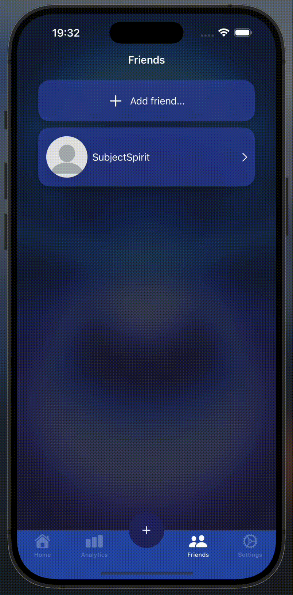

<h1 align="center">Doordie</h1>

Мобильное iOS-приложение для анализа и контроля выполнения привычек.

Проект построен на архитектурном паттерне <strong>SVIP (Simplified View Interactor Presenter)</strong>, адаптированном под iOS-приложения.
Подробнее об этом подходе можно прочитать в статье на <a href="https://habr.com/ru/companies/wildberries/articles/798275/" target="_blank">Habr</a>.   
Дизайн приложения: <a href="https://www.figma.com/design/nKdCb02c5DBx66UjQYCNoD/Doordie?node-id=0-1&t=gqPoeCU1PH40X5Xp-1" target="_blank">Figma</a>  

<table align="center">
  <tr>
    <td align="center">
       
      Диаграмма классов
    </td>
    <td align="center">
       
      Диаграмма частоты использования методов классов
    </td>
  </tr>
</table>

<h2 align="center">Скриншоты приложения и его функционала</h2>

<table align="center">
  <tr>
    <td align="center">
       
      Начальный экран
    </td>
    <td align="center">
       
      Экран входа
    </td>
  </tr>
</table>

<table align="center">
  <tr>
    <td align="center">
       
      Анимация ошибки при вводе несуществующей почты
    </td>
    <td align="center">
       
      Анимация ошибки при вводе неправильного пароля
    </td>
  </tr>
</table>

<table align="center">
  <tr>
    <td align="center">
       
      Экран регистрации (ввода почты)
    </td>
    <td align="center">
       
      Различные анимации при вводе кода подтверждения
    </td>
  </tr>
</table>

<table align="center">
  <tr>
    <td align="center">
       
      Главный экран (без привычек)
    </td>
    <td align="center">
       
      Главный экран
    </td>
  </tr>
</table>

<table align="center">
  <tr>
    <td align="center">
       
      Экран создания привычки
    </td>
    <td align="center">
       
      Экран создания привычки
    </td>
  </tr>
</table>

<table align="center">
  <tr>
    <td align="center">
       
      Экран выполнения привычки с таймером
    </td>
    <td align="center">
       
      Экран аналитики
    </td>
  </tr>
</table>

<table align="center">
  <tr>
    <td align="center">
       
      Экран профиля (раздел друзья)
    </td>
    <td align="center">
       
      Экран друзей
    </td>
  </tr>
</table>

<table align="center">
  <tr>
    <td align="center">
       
      Анимация кастомного slide-action для удаления друга
    </td>
    <td align="center">
       
      Skeleton-loader вместо привычек
    </td>
  </tr>
</table>

<table align="center">
  <tr>
    <td align="center">
       
      Skeleton-loader вместо друзей
    </td>
    <td align="center">
       
      Skeleton-loader вместо друзей
    </td>
  </tr>
</table>

<table align="center">
  <tr>
    <td align="center">
       
      Skeleton-loader вместо аналитики
    </td>
    <td align="center">
       
      Экран настроек
    </td>
  </tr>
</table>
